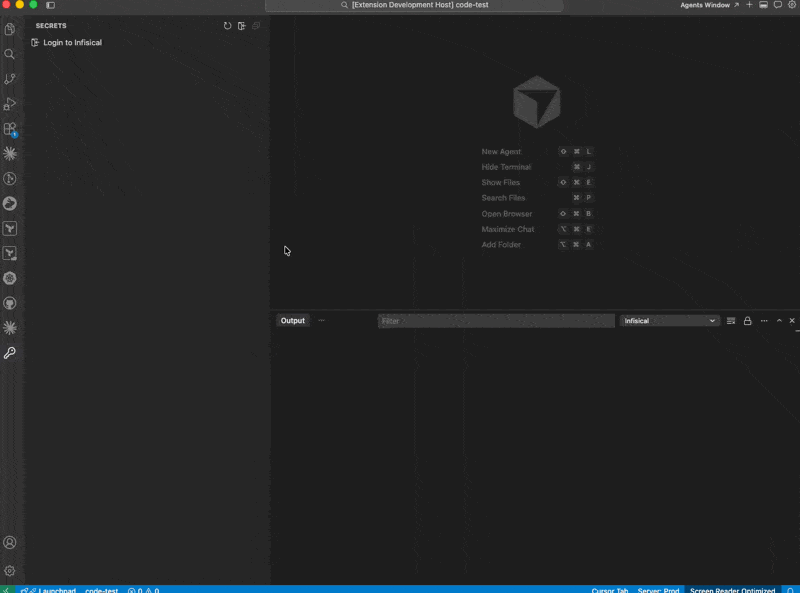
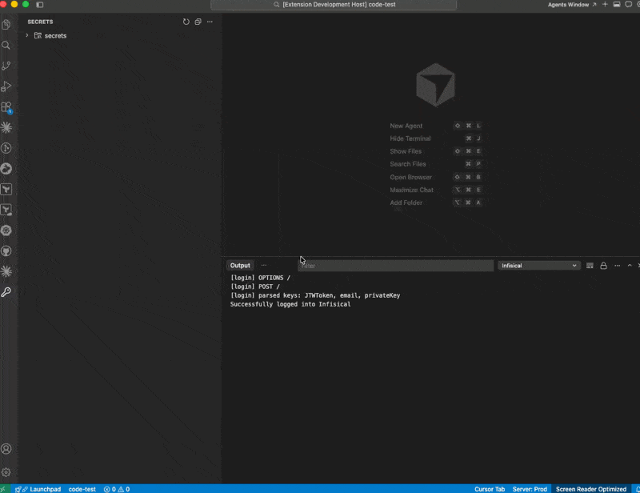
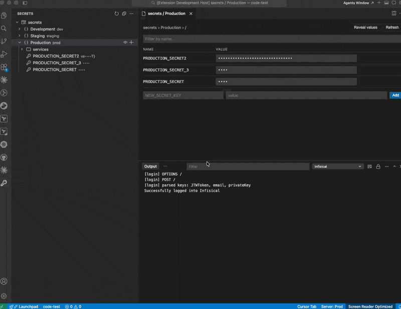
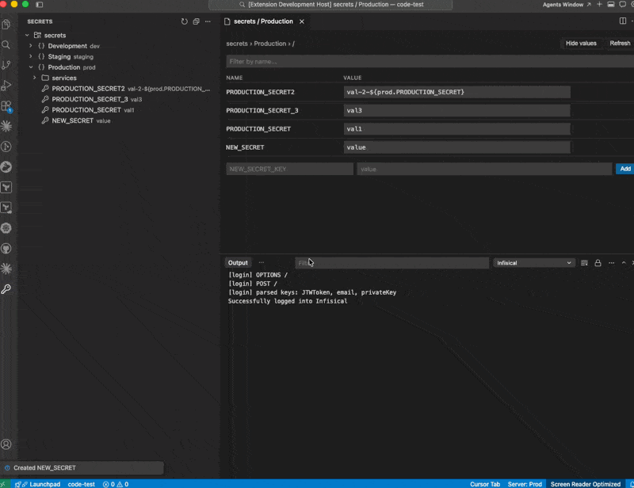

Visual Studio Code (VS Code) extension for [Infisical](https://infisical.com). Browse, view, create, edit, and delete secrets across every project, environment, and folder you have access to — without leaving your editor.

## Features

This extension provides the following capabilities:

1. [Connecting to Infisical](#connecting-to-infisical)
2. [Browsing Secrets](#browsing-secrets)
3. [Revealing Values](#revealing-values)
4. [Reading and Writing Secrets](#reading-and-writing-secrets)
   - [Inline Edit](#inline-edit)
   - [Secrets Panel](#secrets-panel)

### Connecting to Infisical

Sign in with your Infisical account — no client IDs, no machine identities, no copy-pasting tokens. Pick a region (US, EU, or self-hosted), authenticate in your browser, and you're returned to VS Code automatically.

The extension supports Infisical Cloud (US and EU) out of the box, and any self-hosted Infisical instance.

#### Demo

Tokens are stored using VS Code's native [`SecretStorage`](https://code.visualstudio.com/api/references/vscode-api#SecretStorage), encrypted at rest by the OS keychain. If your token is revoked or expires, the extension detects the next `401`, clears the token, and prompts you to log in again.

### Browsing Secrets

Once signed in, the activity-bar Infisical view shows every project, environment, folder, and secret you have access to — mirroring the Infisical web UI. Nothing is fetched until you expand a node, so the view stays fast even on large workspaces.

#### Demo

### Revealing Values

Secret values are masked by default and shown as `••••`. There are three ways to reveal them:

- **Per scope** — click the eye icon on any environment or folder row to reveal every secret in that scope inline.
- **Per secret** — click an individual secret to reveal, copy, edit, or delete it from a quick pick.
- **All at once** — click **Reveal values** in the secrets panel toolbar.

#### Demo

### Reading and Writing Secrets

#### Inline Edit

Right-click any secret in the tree view to edit, copy, or delete it. New secrets can be created directly from the environment or folder row using the inline plus icon.

#### Secrets Panel

Click any environment or folder to open a side-by-side secrets panel that mirrors the Infisical dashboard inside VS Code. The panel supports:

- Filtering secrets by name
- Inline editing — click any value, edit, press `Enter` to save (or `Esc` to cancel)
- Copying single values to the clipboard
- Adding new secrets at the current path
- Toggling all values revealed/hidden with a single button

Edits in either the tree view or the panel automatically refresh the other. Deletions trigger a confirmation dialog to protect against accidents.

#### Demo

## Requirements

Visual Studio Code version 1.74.0 (November 2022) or later.

## Extension Settings

This extension contributes the following settings:

| Setting | Default | Description |
|---------|---------|-------------|
| `infisical.baseUrl` | `https://us.infisical.com` | API base URL for the Infisical instance. The login flow updates this automatically when you pick a region. Set manually only if you're using a self-hosted instance. |

## Commands

All commands are available in the Command Palette (`Cmd/Ctrl + Shift + P`) under the **Infisical** category.

| Command | Description |
|---------|-------------|
| `Infisical: Login` | Sign in via your browser |
| `Infisical: Logout` | Clear stored token |
| `Infisical: Refresh` | Re-fetch projects, environments, folders, and secrets |
| `Infisical: New Secret` | Create a new secret at the selected scope |

## Issues

Found a bug or have a feature request? Open an issue on [GitHub](https://github.com/Infisical/infisical-vscode-extension/issues).
